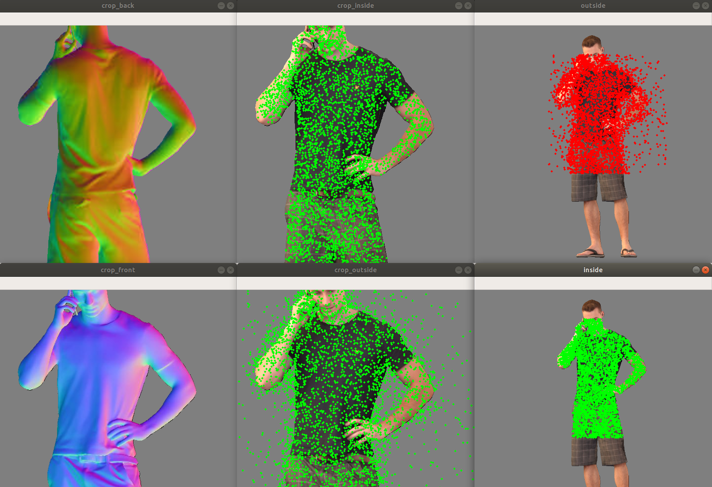
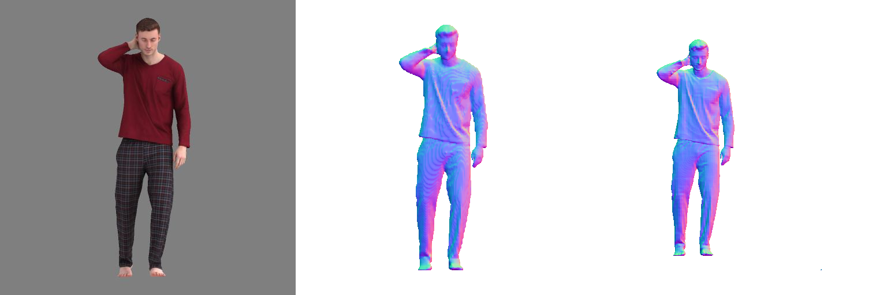
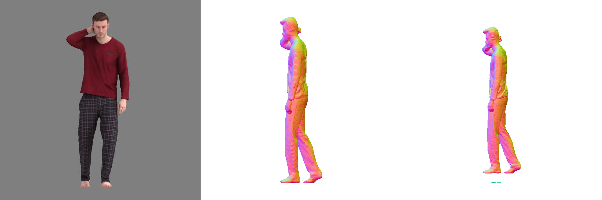

# Open-PIFuhd

This is a **unofficial** implementation of [PIFuhd](https://github.com/facebookresearch/pifuhd)

[PIFuHD: Multi-Level Pixel-Aligned Implicit Function forHigh-Resolution 3D Human Digitization](https://openaccess.thecvf.com/content_CVPR_2020/papers/Saito_PIFuHD_Multi-Level_Pixel-Aligned_Implicit_Function_for_High-Resolution_3D_Human_Digitization_CVPR_2020_paper.pdf)(CVPR2020) 


## Implementation

- [x] Training Coarse PIFuhd
- [x] Training Fine PIFuhd
- [x] Inference
- [x] metrics(P2S, Normal, Chamfer)
- [ ] Gan generates front normal and back normal (Under designing)

Note that the pipeline I design do not consider normal map generated by pix2pixHD because it is **Not** main difficulty we reimplement PIFuhd. By the way, I will release GAN +PIFuhd soon. 

## Prerequisites

- PyTorch>=1.6
- json
- PIL
- skimage
- tqdm
- cv2

- [trimesh](https://trimsh.org/) with [pyembree](https://github.com/scopatz/pyembree)
- [pyexr](https://github.com/tvogels/pyexr)
- PyOpenGL
- freeglut (use `sudo apt-get install freeglut3-dev` for ubuntu users)
- (optional) egl related packages for rendering with headless machines. (use `apt install libgl1-mesa-dri libegl1-mesa libgbm1` for ubuntu users)

## Data processed

We use [Render People](https://renderpeople.com/free-3d-people/) as our datasets but the data size is 296 (270 for training while 29 for testing) which is less than paper said 500.

Note that we are unable to release the full training data due to the  restriction of commertial scans.

### Initial data

I modified part codes in PIFu in order to could process dirs where your model save

```bash
bash ./scripts/process_obj.sh [--dir_models_path]
#e.g.  bash ./scripts/process_obj.sh ../Garment/render_people_train/
```

 ### Rendering data

I modified part codes in PIFu in order to could process dirs where your model save

```Bash
python -m apps.render_data -i [--dir_models_path] -o [--save_processed_models_path] -s 1024 [Optional: -e]
#-e means use GPU rendering
#e.g.python -m apps.render_data -i ../Garment/render_people_train/ -o ../Garment/render_gen_1024_train/ -s 1024 -e
```

### Render Normal Map

Rendering front and back normal map In **Current Project**

```bash
All config params is set in ./configs/PIFuhd_Render_People_HG_coarse.py, bash ./scripts/generate.sh

# the params you could modify from ./configs/PIFuhd_Render_People_HG_normal_map.py
# the import params here is 
#  e.g. input_dir = '../Garment/render_gen_1024_train/' and cache= "../Garment/cache/render_gen_1024/rp_train/"
# inpud_dir means output render_gen_1024_train
# cache means where save intermediate results like sample points from mesh
```

After processing all datasets, **Tree-Structured Directory** looks like following:

```
render_gen_1024_train/
├── rp_aaron_posed_004_BLD
│   ├── GEO
│   ├── MASK
│   ├── PARAM
│   ├── RENDER
│   ├── RENDER_NORMAL
│   ├── UV_MASK
│   ├── UV_NORMAL
│   ├── UV_POS
│   ├── UV_RENDER
│   └── val.txt
├── rp_aaron_posed_005_BLD
	....
```


## Training 

### Training coarse-pifuhd

All config params is set in ./configs/PIFuhd_Render_People_HG_coarse.py, Where you could modify all you want.

Note that this project I designed is friend, which means you could easily replace origin backbone, head by yours :)

```bash 
bash ./scripts/train_pfhd_coarse.sh
```

### Training Fine-PIFuhd

the same as coarse PIFuhd, all config params is set in ./configs/PIFuhd_Render_People_HG_fine.py, 

```bash 
bash ./scripts/train_pfhd_fine.sh
```

**If you meet memory problems about GPUs, pls reduce batch_size in ./config/*.py **

## Inference

```bash
bash ./scripts/test_pfhd_coarse.sh
#or 
bash ./scripts/test_pfhd_fine.sh
```

the results will be saved into checkpoints/PIFuhd_Render_People_HG_[coarse/fine]/gallery/test/model_name/*.obj, then you could use meshlab to view the generate models.

## Metrics

```bash
export MESA_GL_VERSION_OVERRIDE=3.3 
# eval coarse-pifuhd
python ./tools/eval_pifu.py  --config ./configs/PIFuhd_Render_People_HG_coarse.py
# eval fine-pifuhd
python ./tools/eval_pifu.py  --config ./configs/PIFuhd_Render_People_HG_fine.py
```

## Demo

we provide rendering code using free models in [RenderPeople](https://renderpeople.com/free-3d-people/). This tutorial uses `rp_dennis_posed_004` model. Please download the model from [this link](https://renderpeople.com/sample/free/rp_dennis_posed_004_OBJ.zip) and unzip the content. Use following command to reconstruct the model:

```bash

```

## Debug

I provide bool params(debug in all of config files) to you to check whether your points sampled from mesh is right. There are examples:



## Visualization

**As following show, left is input image, mid is the results of coarse-pifuhd, right is fine-pifuhd**






## Reconstruction on Render People Datasets

|                                       | IoU        | ACC        | recall     |  P2S  | Normal | Chamfer |
| :------------------------------------ | ---------- | ---------- | ---------- | :---: | :----: | :-----: |
| PIFu                                  | 0.748      | 0.880      | 0.856      | 1.801 | 0.1446 |  2.00   |
| Coarse-PIFuhd(+Front and back normal) | 0.865(5cm) | 0.931(5cm) | 0.923(5cm) | 1.242 | 0.1205 | 1.4015  |
| Fine-PIFuhd(+Front and back normal)   | 0.813(3cm) | 0.896(3cm) | 0.904(5cm) |   -   | 0.1138 |    -    |

**There is an issue why p2s of fine-pifuhd is bit large than coarse-pifuhd. This is because I do not add some post-processing to clean some chaos in reconstruction. However, the details of human mesh produced by fine-pifuhd are obviously better than coarse-pifuhd.**

## About Me

I hope that this project could provide some contributions to our communities, especially for implicit-field.

By the way, If you think the project is helpful to you, pls don’t forget to star this project : ) 

## Related Research

**[Monocular Real-Time Volumetric Performance Capture (ECCV 2020)](https://project-splinter.github.io/)**
 *Ruilong Li\*, Yuliang Xiu\*, Shunsuke Saito, Zeng Huang, Kyle Olszewski, Hao Li*

**[PIFuHD: Multi-Level Pixel-Aligned Implicit Function for High-Resolution 3D Human Digitization (CVPR 2020)](https://shunsukesaito.github.io/PIFuHD/)**
 *Shunsuke Saito, Tomas Simon, Jason Saragih, Hanbyul Joo*

**[ARCH: Animatable Reconstruction of Clothed Humans (CVPR 2020)](https://arxiv.org/pdf/2004.04572.pdf)**
 *Zeng Huang, Yuanlu Xu, Christoph Lassner, Hao Li, Tony Tung*

**[Robust 3D Self-portraits in Seconds (CVPR 2020)](http://www.liuyebin.com/portrait/portrait.html)**
 *Zhe Li, Tao Yu, Chuanyu Pan, Zerong Zheng, Yebin Liu*

**[Learning to Infer Implicit Surfaces without 3d Supervision (NeurIPS 2019)](http://papers.nips.cc/paper/9039-learning-to-infer-implicit-surfaces-without-3d-supervision.pdf)**
 *Shichen Liu, Shunsuke Saito, Weikai Chen, Hao Li*